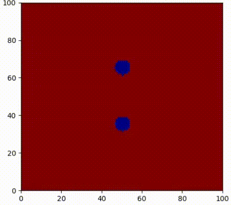

# Изучение динамики формирования "мостов", образующихся в процессе кристаллизации
В процессе кристаллизации между двумя центрами формируется "мост". Цель исследования заключалась в описании динамики и формы образующегося моста.

Подробно об исследовании можно прочитать в прикреплённой презентации. Здесь же перечислю основные шаги работы над проектом (за исключением экспериментальной установки, так как она слегка сложна ).
## Оценка скорости роста моста
Были рассмотрены 2 теоретических подхода. "Макроскопический" подход основан на чужой статье и плохо согласуется с экспериментом. Наш собственный подход, рассматривающий систему на микроскопческом уровне, с экспериментом сходится.

## Опиание формы моста
Для описания формы также были использованы 2 подхода.
Один из них - аналитический, другой же заключался в компьютерном моделировании процесса.

Симуляция написана на Pytohn и использует разностную схему аналогичную проекту `Thermal-conductivity` из моего репозитория.
Однако в нашем случае моделируется двухфазная среда, в одной из вариаций программы слой льда выделяется чёрным цветом.
